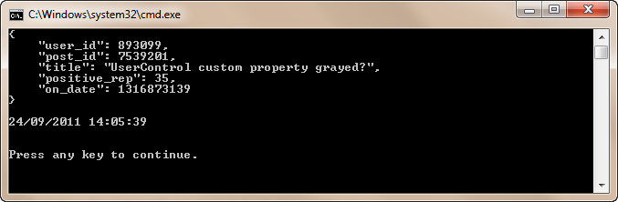
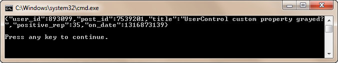

# Writing a custom Json.NET DateTime Converter

## Introduction

Last weekend I was playing around with the [Stack Exchange API](http://api.stackoverflow.com). All the API responses are expressed in [JSON](http://en.wikipedia.org/wiki/Json). So I decided to use the [Json.NET library](http://james.newtonking.com/projects/json-net.aspx) to easily deserialize the JSON responses into simple .NET objects.

This library has great support for deserialing JSON into .NET objects and serializing them back into JSON. For example, if you want to serialize an object to a JSON string all you have to do is decorate the type with some attributes.

For example:

```csharp
[JsonObject(MemberSerialization.OptIn)]
public class Person
{
  [JsonProperty]
  public string Name { get; set; }

  [JsonProperty]
  [JsonConverter(typeof(IsoDateTimeConverter))]
  public DateTime BirthDate { get; set; }
}
```

Notice that for the BirthDate property a specific converter is specified ([IsoDateTimeConverter](http://james.newtonking.com/projects/json/help/html/T_Newtonsoft_Json_Converters_IsoDateTimeConverter.htm)). Sometimes it is not enough to tell Json.NET which properties should be serialized. You need to help it out a bit and inform it how the properties should be serialized / deserialized. Here the IsoDateTimeConverter informs Json.NET that it should serialize the birthdate into an ISO 8601 date format.

The Stack Exchange API uses Unix timestamps to express all of its timestamps. Out of the box Json.NET does not contain a converter that can handle this notation for DateTime properties. But luckily we can create our own. It's actually very easy, let's see how we can do this...

## JSON Response

Let's use one of the responses from the StackExchange API to test our custom DateTime converter. For one call (/users/{id}/reputation), the StackExchange API returns the following JSON string:

```json
{
  "user_id": 893099,
  "post_id": 7539201,
  "title": "UserControl custom property grayed?",
  "positive_rep": 35,
  "on_date": 1316873139
}
```

Notice that the on_date property property is expressed as a Unix timestamp.

**Remark**: The actual response is quite a bit longer, and slightly more complicated. I shortened it for this demo. Check ouf the [/users/{id}/reputation API method](http://api.stackoverflow.com/1.1/usage/methods/user-reputation-changes) if you are interested in the full response.

## ReputationChange Class

Let's create a simple class in which we can deserialize this JSON string.

```csharp
[JsonObject(MemberSerialization.OptIn)]
public class ReputationChange
{
    [JsonProperty(PropertyName = "user_id")]
    public int UserId { get; set; }

    [JsonProperty(PropertyName = "post_id")]
    public int PostId { get; set; }

    [JsonProperty(PropertyName = "title")]
    public string Title { get; set; }

    [JsonProperty(PropertyName = "positive_rep")]
    public int PossitiveReputation { get; set; }

    [JsonProperty(PropertyName = "on_date")]
    [JsonConverter(typeof(UnixDateTimeConverter))]
    public DateTime OnDate { get; set; }
}
```

As you can see, the OnDate property has been decorated with a new attribute. A new type of converter, namely the UnixDateTimeConverter type. Let's see what makes it tick.

## UnixDateTimeConverter Class

If you want to create your own Json.NET convertor you must create a new type which descends from the abstract [JsonConverter](http://james.newtonking.com/projects/json/help/html/T_Newtonsoft_Json_JsonConverter.htm) type. However, for converting a DateTime to and from JSON the library provides the abstract [DateTimeConverterBase](http://james.newtonking.com/projects/json/help/html/T_Newtonsoft_Json_Converters_DateTimeConverterBase.htm) type which already does some of the plumbing for you.

```csharp
public class UnixDateTimeConverter : DateTimeConverterBase
{
  //...
}
```

To create your own DateTime converter you must override two methods, namely:

- **ReadJson(JsonReader, Type, Object, JsonSerializer)**: Reads the JSON representation of the object.
- **WriteJson(JsonWriter, Object, JsonSerializer)**: Writes the JSON representation of the object.

Let's start with parsing the JSON representation of a Unix timestamp into a valid DateIime structure.

```csharp
public override object ReadJson(JsonReader reader, Type objectType, object existingValue,
    JsonSerializer serializer)
{
    if (reader.TokenType != JsonToken.Integer)
    {
        throw new Exception(
            String.Format("Unexpected token parsing date. Expected Integer, got {0}.",
            reader.TokenType));
    }

    var ticks = (long) reader.Value;

    var date = new DateTime(1970, 1, 1);
    date = date.AddSeconds(ticks);

    return date;
}
```

The ReadJson(...) method is called by Json.NET when it needs to parse the JSON string that contains the value for your DateTime. The reader (JsonReader) instance is already correctly positioned.

The [Unix time](http://en.wikipedia.org/wiki/Unix_time) contains the number of seconds that elapsed since midnight (UTC) of January 1, 1970. So first we make sure if we are dealing with a valid integer and if so, we add the number of seconds to January 1, 1970.

Now we also need to be able to serialize a DateTime into a valid JSON string. Time ot override the WriteJson(...) method.

```csharp
public override void WriteJson(JsonWriter writer, object value,
    JsonSerializer serializer)
{
    long ticks;
    if (value is DateTime)
    {
        var epoc = new DateTime(1970, 1, 1);
        var delta = ((DateTime) value) - epoc;
        if (delta.TotalSeconds < 0)
        {
            throw new ArgumentOutOfRangeException(
                "Unix epoc starts January 1st, 1970");
        }
        ticks = (long) delta.TotalSeconds;
    }
    else
    {
        throw new Exception("Expected date object value.");
    }
    writer.WriteValue(ticks);
}
```

Now we take our DateTime and calculate the amount of seconds that passed since January 1, 1970. Then we write this value out to the JsonWriter instance that the Json.NET library provides to us.

## Demo

Let's see it in action. I created a simple console application for this and stored some JSON data in a text file instead of directly contacting the StackExchange API.

```csharp
// Read JSON data
var json = File.ReadAllText("json.txt");
Console.WriteLine(json);
Console.WriteLine();

// Deserialize JSON into ReputationChange object
var reputation = JsonConvert.DeserializeObject<ReputationChange>(json);
Console.WriteLine(reputation.OnDate);
Console.WriteLine();
```

The result:



Let's serialize the ReputationChange object back to a JSON string.

```csharp
// Serialize ReputationChange object back into JSON
json = JsonConvert.SerializeObject(reputation);
Console.WriteLine(json);
```

The result:



Voila, thanks to the custom UnixDateTimeConverter converter you can easily deserialize a Unix timestamp into a DateTime and serialize it back to a JSON string. That about wraps up this short article.

**Tip**: A good way to figure out how to write your own converter is to download the [source code of the Json.NET library](http://json.codeplex.com/) from CodePlex. Just take a look at how the existing converters were written and start from there. And of course the [official documentation](http://james.newtonking.com/projects/json/help/) will also help you out.

Have fun with serializing all the things!


